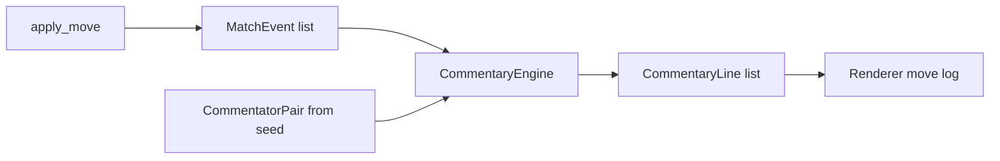

# Commentary booth design

Dual-voice wrestling broadcast: play-by-play calls the action, color reacts and
takes a side. Each match picks **one curated pair** from the commentator roster,
seeded for replay and playtest reproducibility.

Implementation status:

| Piece | Status |
|-------|--------|
| Commentator roster + curated pairs | [`prototype/commentators.py`](../prototype/commentators.py) |
| `MatchEvent` contract | [`prototype/commentary_events.py`](../prototype/commentary_events.py) |
| `CommentaryEngine` + dual-voice move log | [`prototype/commentary.py`](../prototype/commentary.py), wired in `main.py` |
| Per-move per-commentator templates | [`prototype/commentary_templates.py`](../prototype/commentary_templates.py) |
| Events from `apply_move` | wired — legacy `log` kept for playtest migration |

Dialog evaluation: [`docs/dialog-eval-design.md`](dialog-eval-design.md).

---

## Target experience

Classic TV is not one narrator getting fancier. It is a **booth exchange**:

```
GORILLA:  Hitman with the collar-and-elbow — they're tied up!
JESSE:    Oh, here we go. Hall's about to teach him a lesson.
GORILLA:  Side headlock… arm drag! Hall goes down!
JESSE:    Beautiful. Textbook.
```

| Role | Job | Archetypes in roster |
|------|-----|----------------------|
| **Play-by-play** (`pbp`) | Who, what, result — in order | Gorilla, Ross |
| **Color** (`color`) | Reaction, bias, jokes, dread | Ventura, Heenan, Lawler, Cornette |

Pairs are **curated**, not combinatorial. Gorilla + Jesse works because one stays
straight and one agitates; two play-by-play voices talking over each other does not.

---

## Architecture



**Today:** `apply_move` still returns f-string logs. The booth name appears at
the bell only.

**Next:** `apply_move` emits `MatchEvent` facts; `CommentaryEngine.render_turn`
maps them to alternating PBP/color lines using per-commentator template pools.

That split is what makes the dialog framework work for commentary: Layer 1 checks
**events → lines**, not regex against prose buried in `game.py`.

---

## Commentator roster

[`prototype/commentators.py`](../prototype/commentators.py) mirrors
[`prototype/wrestlers.py`](../prototype/wrestlers.py): frozen dataclasses, a
`ROSTER` dict, and list helpers.

Each `Commentator` carries:

- **Identity:** `id`, `name`, `short` (log prefix, e.g. `GORILLA`)
- **Role:** `pbp` or `color` — enforced when validating pairs
- **Voice knobs:** `register`, `bias`, `intensity` (1–5 near-fall urgency)
- **Style data:** `catchphrases`, `vocab`, `avoid` (reserved engine jargon)

Archetypes are **inspired by** classic booths, not trademark clones. Catchphrases
are rare garnish in template pools, not every line.

### Curated pairs (default)

| PBP | Color | Vibe |
|-----|-------|------|
| Gorilla Monsoon | Jesse Ventura | WWF straight + heel conspiracist |
| Gorilla Monsoon | Bobby Heenan | Classic WWF booth |
| Gorilla Monsoon | Jim Cornette | Straight PBP + outrage |
| Jim Ross | Jerry Lawler | Urgent PBP + Memphis asides |
| Jim Ross | Jim Cornette | Urgent PBP + outrage |

### Pair selection

```python
from commentators import choose_commentary_team

booth = choose_commentary_team(match_seed)  # XOR salt, independent of move RNG
# booth.ids → ("gorilla", "ventura")
# booth.label() → "Gorilla Monsoon & Jesse Ventura"
```

Playtest transcripts record `commentary_team` and `commentary_team_label` on
`match_start`. Future judge agents can score **booth chemistry** per pair.

---

## Turn choreography (when events land)

Who speaks when — rules the `CommentaryEngine` will encode:

| Event kind | PBP | Color |
|------------|-----|-------|
| Setup / position | Names the move first | Mocks or reads intent (optional) |
| Clean hit | Impact + damage | Reaction line |
| Miss / reversal | Calls the whiff | Blames someone |
| Groggy / finisher window | States the fact | Hypes or dreads |
| Near-fall | **Owns** the count with ref | Waits for kickout pop |
| Pin/sub finish | Calls sequence | Speaks only if room |

Discipline rules:

- PBP never restates what color just said.
- Color speaks on ~40–60% of routine turns; every turn gets PBP.
- Near-falls are PBP-owned; color waits for the kickout.
- Catchphrases capped per match.

Templates are keyed by `(commentator_id, event.kind, stakes_tier)` with variant
pools for freshness — measured by `phrasing_diversity` in dialog telemetry.

### Per-move overrides

[`prototype/commentary_templates.py`](../prototype/commentary_templates.py) holds
optional lines per `(move_id, commentator_id)`:

```python
@dataclass(frozen=True)
class CommentatorMoveTemplates:
    success: tuple[str, ...] = ()   # damage, setup, submission_applied, recover
    failed: tuple[str, ...] = ()    # reversal, miss
```

When a turn's primary event is a success or failure kind and the registry has a
non-empty pool for that move and speaker, `CommentaryEngine._pick_line` chooses
from it before the generic `(commentator_id, event.kind)` pools.

Interpolation keys: `{actor}`, `{target}`, `{actor_name}`, `{target_name}`,
`{move}`, `{move_id}`, `{count_word}`.

Example:

```python
"punch": {
    "gorilla": CommentatorMoveTemplates(
        success=("{actor} snaps a straight right — {target} eats it!",),
    ),
    "heenan": CommentatorMoveTemplates(
        failed=("Give me a break! {actor} whiffed that punch!",),
    ),
},
```

`validate_move_commentary()` checks that every `move_id` key exists in
`moves.all_move_rules()`.

---

## UI

Move log blocks today store one `log_text` blob per wrestler turn
(`render_fixed._ActionBlock`). Dual commentary becomes:

```python
class CommentaryLine(NamedTuple):
    speaker: str   # "GORILLA"
    text: str
    role: Literal["pbp", "color"]
```

Render as prefixed lines with palette distinction (bold PBP, dim color). Scroll
animation unchanged — feed 2–4 short lines instead of one paragraph.

Match header already shows `On the call: Gorilla Monsoon & Jesse Ventura` via
`CommentatorPair.intro_line()`.

---

## Evaluation

| Layer | Commentary-specific |
|-------|---------------------|
| **Layer 1** | Every `MatchEvent` has a faithful PBP line; no invented facts |
| **Layer 2 judge** | clarity, voice, freshness, escalation + **role discipline**, **personality consistency**, **booth chemistry** |

Coverage shifts from narration sites in `game.py` to
**(event kind × stakes tier × commentator × role)** once events ship.

---

## Build order

1. **Roster + pair selection + bell intro** — done.
2. **`apply_move` → `MatchEvent[]`** — return events alongside legacy log during migration.
3. **`CommentaryEngine.render_turn`** — template pools per commentator; dual-voice log.
4. **Personality pass** — bias (Heenan roots for CPU), intensity on near-falls, catchphrase caps.
5. **Extend playtest schema** — `events[]`, `commentary[]` with `speaker`/`role` on each turn.
6. **Optional LLM color** — high-stakes events only, Layer 1 checks output against events.

Step 6 is late and optional. Template booths with good choreography already read
as wrestling TV.

---

## Adding a commentator

1. Add a `Commentator` entry to `ROSTER` in `commentators.py`.
2. Add one or more `CommentatorPair` rows to `CURATED_PAIRS` (PBP + color only).
3. Run `python3 -m unittest tests.test_commentators -q`.
4. When `CommentaryEngine` exists, add template pools for the new id per `EventKind`.

Do not add every possible pair — curate booths that complement each other.
